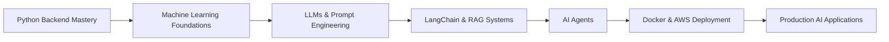

<div align="center">

<!-- Animated Wave Banner -->


<!-- Typing SVG -->
<a href="https://git.io/typing-svg">
  
</a>

<br/>


</div>

<br/>

## 🧠 About Me

```python
class NeelVadukiya:
    def __init__(self):
        self.role = "Python Full Stack Developer | Aspiring AI Engineer"
        self.location = "Surat, Gujarat, India"
        self.stack = ["Python", "Django", "DRF", "FastAPI", "JavaScript"]
        self.currently_learning = ["Machine Learning", "LLMs", "LangChain", "RAG", "Docker", "AWS"]
        self.goal = "Build scalable, AI-powered backend systems"
        self.fun_fact = "I turn ☕ into clean, production-ready code"

    def say_hi(self):
        print("Thanks for stopping by — let's build something great!")

me = NeelVadukiya()
me.say_hi()
```

- 🎓 B.Tech in Computer Engineering — Ganpat University (2023–2026)
- 💼 6-month Python Full Stack Developer Internship @ **Brainybeam Infotech Pvt. Ltd.**
- 🧩 Experienced in building **RESTful APIs**, **MVC architecture**, and **relational database design**
- 🤖 Passionate about **Artificial Intelligence**, **Machine Learning**, and **AI Agents**
- 🌱 Actively learning to bridge **Backend Engineering** with **AI/LLM systems**
- 🎯 Seeking **Software Engineer / AI Engineer** opportunities

<br/>

## ⚡ Current Focus

| 🔭 Working On | 🌱 Learning | 🎯 Goal |
|---|---|---|
| Django & DRF backend systems | Machine Learning & LLMs | Become an AI-powered Software Engineer |
| RESTful API design | LangChain & RAG pipelines | Ship production-grade AI applications |
| Full stack web apps | Docker & AWS | Contribute to scalable open-source projects |

<br/>

## 🛠️ Tech Stack

### Languages & Core
<p>
  
</p>

### Backend & Frameworks
<p>
  
</p>
<p>
  
  
</p>

### Databases
<p>
  
</p>

### Frontend
<p>
  
</p>

### Tools & Platforms
<p>
  
</p>

### 🤖 AI & ML Technologies (Currently Exploring)
<p>
  
  
  
  
  
</p>
<p>
  
</p>

<br/>

## 📊 GitHub Analytics

<div align="center">


</div>

<div align="center">
  
</div>

<br/>

## 🏆 GitHub Trophies

<div align="center">
  
</div>

<br/>

## 🐍 Contribution Snake

<div align="center">
  
</div>

<br/>

## 🚀 Featured Projects

<div align="center">

<a href="https://github.com/NeelVadukiya/ShopKart">
  
</a>
<a href="https://github.com/NeelVadukiya/pharmacentral_project">
  
</a>

</div>

**🛒 ShopKart** — Full-featured eCommerce platform with user authentication, cart management, stock deduction on purchase, checkout price snapshotting, and an admin dashboard for real-time order tracking.
`Python` `Django` `DRF` `SQLite3` `Bootstrap 5`

**💊 PharmaCentral** — Real-time pharmacy management system with drug inventory tracking, customer & debtor management, keyword-based drug search, and dual-parameter automated alerts for expiry and low stock.
`Python` `Django` `DRF` `SQLite3` `JavaScript`

<br/>

## 🗺️ Learning Roadmap



<br/>

## 💬 Quote of the Day

<div align="center">
  
</div>

<br/>

## 📫 Let's Connect

<div align="center">

<a href="https://www.linkedin.com/in/neel-vadukiya-495099285">
  
</a>
<a href="mailto:neelvadukiya789@gmail.com">
  
</a>
<a href="https://neel-vadukiya-portfolio.netlify.app">
  
</a>
<a href="https://github.com/NeelVadukiya">
  
</a>

</div>

<br/>

<div align="center">

### 💡 "Code is the bridge between imagination and impact."


**⭐ Thanks for visiting — let's build something intelligent together!**

</div>
